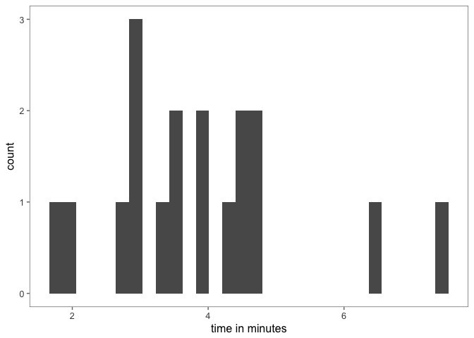
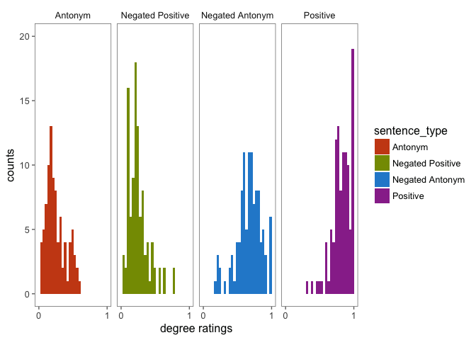
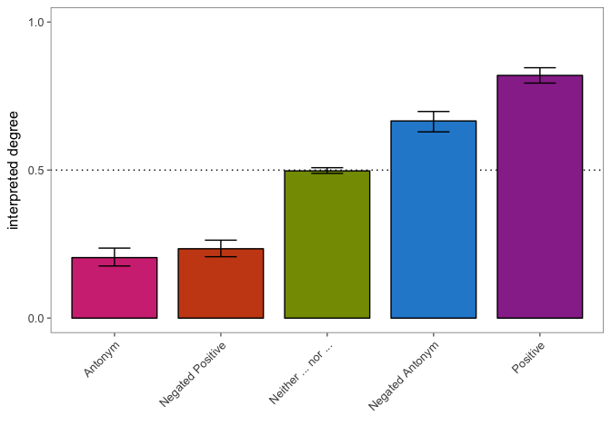
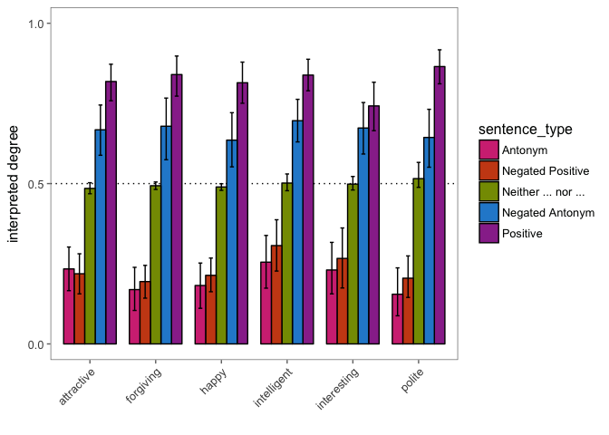
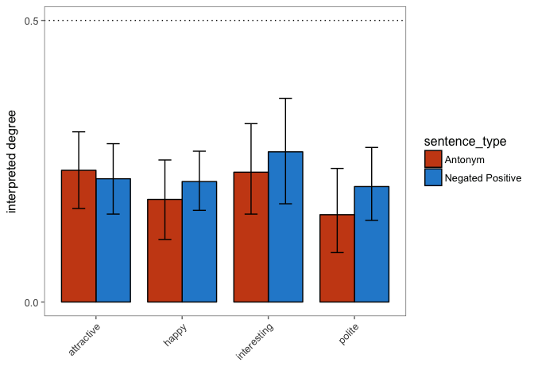

2\_L1
================

``` r
library(tidyverse)
```

    ## Loading tidyverse: tibble
    ## Loading tidyverse: tidyr
    ## Loading tidyverse: readr
    ## Loading tidyverse: purrr
    ## Loading tidyverse: dplyr

    ## Warning: package 'dplyr' was built under R version 3.4.2

    ## Conflicts with tidy packages ----------------------------------------------

    ## combine(): dplyr, gridExtra
    ## filter():  dplyr, stats
    ## lag():     dplyr, stats

``` r
library(tidyboot)
```

    ## Warning: package 'tidyboot' was built under R version 3.4.2

    ## 
    ## Attaching package: 'tidyboot'

    ## The following objects are masked _by_ '.GlobalEnv':
    ## 
    ##     ci_lower, ci_upper

``` r
library(ggthemes)
library(ggpirate)
library(langcog)
```

    ## 
    ## Attaching package: 'langcog'

    ## The following objects are masked _by_ '.GlobalEnv':
    ## 
    ##     ci_lower, ci_upper, get_stars, sem

    ## The following objects are masked from 'package:tidyboot':
    ## 
    ##     ci_lower, ci_upper

    ## The following objects are masked from 'package:ggthemes':
    ## 
    ##     scale_color_solarized, scale_colour_solarized,
    ##     scale_fill_solarized

    ## The following object is masked from 'package:base':
    ## 
    ##     scale

``` r
library(knitr)
theme_set(theme_few())
```

``` r
d.l1 <- read.csv("../data/2_L1_oneslider/2_L1_oneslider-trials.csv") %>%
  mutate(sentence_type = factor(sentence_type,
                                levels = c("antonym",
                                           "neg_positive",
                                           "neither_pos_nor_ant",
                                           "neg_antonym",
                                           "positive"),
                                labels = c("Antonym",
                                           "Negated Positive",
                                           "Neither ... nor ...",
                                           "Negated Antonym",
                                           "Positive")))
  
d.l1.time <- read.csv("../data/2_L1_oneslider/2_L1_oneslider-time.csv")
```

Time to complete task

``` r
ggplot(d.l1.time, aes(x = time)) +
  geom_histogram()+
  xlab("time in minutes")
```

    ## `stat_bin()` using `bins = 30`. Pick better value with `binwidth`.



``` r
d.l1.censored <- left_join(d.l1,
  d.l1.time) %>%
  filter(time > 2)
```

    ## Joining, by = "workerid"

``` r
d.l1.comments <- read.csv("../data/2_L1_oneslider/2_L1_oneslider-subject_information.csv")

d.l1.comments %>% select(comments) %>% filter(comments != "") %>% kable()
```

| comments                                     |
|:---------------------------------------------|
| Fun task                                     |
| Easy to use design. I had no issues. Thanks. |
| Thank you.                                   |
| n/a                                          |
| Great experiment!                            |
| no other comments                            |

``` r
d.l1 %>%
  filter(sentence_type != "Neither ... nor ...") %>%
ggplot(., aes( x = response,
                       fill = sentence_type))+
  geom_histogram(position = position_dodge())+
  #geom_density(alpha = 0.3)+
  facet_wrap(~sentence_type, nrow = 1)+
  scale_fill_solarized()+
  ylab("counts")+
  xlab("degree ratings")+
  scale_x_continuous(limits = c(-0.01, 1.01), breaks = c(0, 1))#+
```

    ## `stat_bin()` using `bins = 30`. Pick better value with `binwidth`.

    ## Warning: Removed 4 rows containing missing values (geom_bar).



``` r
 # guides(fill = F)

# ggsave("~/Documents/research/talks/vagueness/negAnt_histograms.pdf", 
#        width = 6, height = 3)
```

``` r
d.l1.boot <- d.l1 %>%
  group_by(sentence_type) %>%
  multi_boot_standard(col = "response")
```

``` r
d.l1.boot %>%
ggplot(., aes(x = sentence_type,
                      y = mean,
                       ymin = ci_lower, ymax = ci_upper,
                       fill = sentence_type,
              group = sentence_type))+
  geom_hline(yintercept = 0.5, lty = 3)+
  geom_col(position = position_dodge(0.5), width = 0.8, color = 'black')+
  geom_errorbar(position = position_dodge(0.5), color = 'black',
                width = 0.3)+
  scale_fill_solarized()+
  #coord_flip()+
  #guides(fill = F)+
  xlab("")+
  ylab("interpreted degree")+
  scale_y_continuous(limits = c(0,1), breaks = c(0, 0.5,1))+
  theme(axis.text.x = element_text(angle = 45, hjust = 1, vjust = 1))+
  guides(fill = F)
```



``` r
#ggsave("~/Documents/research/talks/vagueness/cusp-2017/not-unhappy_bootstrapped.pdf", width = , height = 3.5)
```

``` r
d.l1.boot.adj <- d.l1 %>%
  group_by(positive, sentence_type)  %>%
  multi_boot_standard(col = "response")

d.l1.boot.adj %>%
ggplot(., aes(x = positive,
                      y = mean,
                       ymin = ci_lower, ymax = ci_upper,
                       fill = sentence_type,
              group = sentence_type))+
  geom_hline(yintercept = 0.5, lty = 3)+
  geom_col(position = position_dodge(0.8), width = 0.8, color = 'black')+
  geom_errorbar(position = position_dodge(0.8), color = 'black',
                width = 0.3)+
  scale_fill_solarized()+
  #coord_flip()+
  #guides(fill = F)+
  xlab("")+
  ylab("interpreted degree")+
  scale_y_continuous(limits = c(0,1), breaks = c(0, 0.5,1))+
  theme(axis.text.x = element_text(angle = 45, hjust = 1, vjust = 1))
```



``` r
d.l1.boot.adj %>%
  filter(sentence_type %in% 
           c("Negated Positive", "Antonym"),
         positive %in% c("attractive", "happy",
                         "interesting", "polite")) %>%
ggplot(., aes(x = positive,
                      y = mean,
                       ymin = ci_lower, ymax = ci_upper,
                       fill = sentence_type,
              group = sentence_type))+
  geom_hline(yintercept = 0.5, lty = 3)+
  geom_col(position = position_dodge(0.8), width = 0.8, color = 'black')+
  geom_errorbar(position = position_dodge(0.8), color = 'black',
                width = 0.3)+
  scale_fill_solarized()+
  #coord_flip()+
  #guides(fill = F)+
  xlab("")+
  ylab("interpreted degree")+
  scale_y_continuous(limits = c(0,0.5), breaks = c(0, 0.5))+
  theme(axis.text.x = element_text(angle = 45, hjust = 1, vjust = 1))
```



``` r
#ggsave("~/Documents/research/talks/vagueness/cusp-2017/explore-items.pdf", width = 5, height = 3.5)
```
