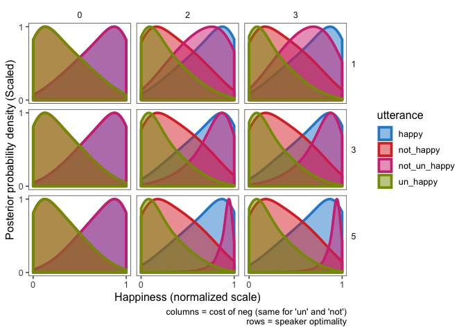
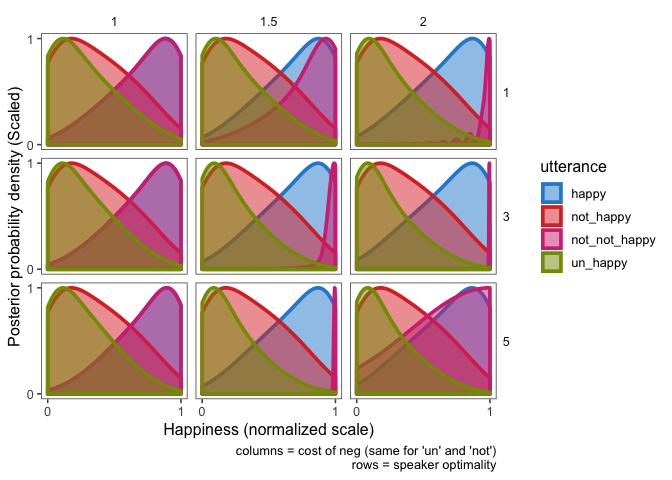
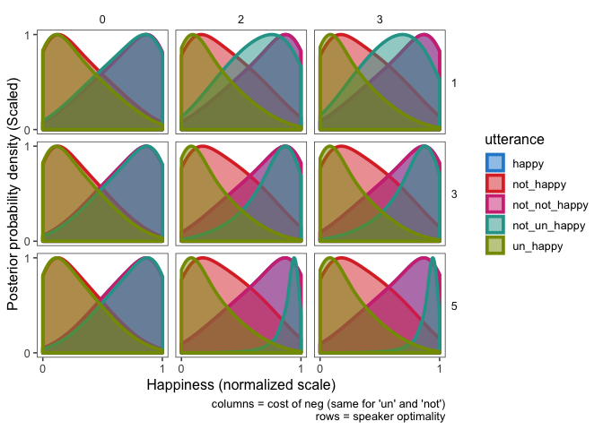
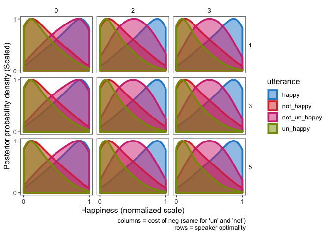

Exploring alternative utts and model parameters
================
MH Tessler
March 11, 2019

``` r
knitr::opts_chunk$set(warning=F, cache=F, message=F, sanitize = T)
```

``` r
library(rwebppl)
library(jsonlite)
library(ggthemes)
library(tidyverse)
library(ggplot2)
library(knitr)
theme_set(theme_few())
```

# “Bonafide antonyms model” (Separate thresholds RSA)

  - Multiplicative cost vs. additive cost
  - 5 alternative sets:
      - A1: \[“happy”, “not unhappy”, “not happy”, “unhappy”\]
      - A2: \[“happy”, “not unhappy”, “not happy”, “not not happy”\]
      - A3: \[“happy”, “not unhappy”, “not happy”, “unhappy”, “not not
        happy”\]
      - A4: \[“happy”, “not unhappy”, “not happy”, “unhappy”, “not sad”,
        “sad”\]
      - A5: \[“happy”, “not unhappy”, “not happy”, “unhappy”, “not sad”,
        “sad”, “not not happy”\]
      - A6: { “happy”: \[“happy”, “not happy”\], “unhappy”: \[“happy”,
        “unhappy”, “not unhappy”\], “not unhappy”: \[“happy”,
        “unhappy”, “not unhappy”\], “not happy”: \[“happy”, “not
        happy”\] }
  - Speaker optimality: \[1, 3, 5\]
  - Cost (per neg): \[0, 2, 4\]

If “sad” is in alternative set, new threshold for “sad”

``` r
pragListener.params <- expand.grid(
  speaker_optimality = c(1, 3, 5),
  #cost_neg = c(0, 2, 4),
  multiplicative_cost = c(T, F),
  alternative_utterances = c("a1", "a2", "a3", "a4", "a5", "a6")
)


# pragListener.params <- expand.grid(
#   speaker_optimality = c(1),
#   cost_neg = c(1),
#   multiplicative_cost = c(T),
#   alternative_utterances = c("a1")
# )

rs.listener.wp.tidy <- webppl(program_file = "webppl_models/bonafide_antonyms.wppl",
                         data = pragListener.params,
                         data_var = "all_opts") %>%
  bind_rows(.) 
# %>%
#          mutate(utterance = factor(utterance,
#                             levels = c("un_happy",
#                                        "not_happy",
#                                        "not_un_happy",
#                                        "happy"),
#                           labels = c( "unhappy","not happy",  "not unhappy","happy")))

rs.listener.wp.tidy.samples <- get_samples(rs.listener.wp.tidy %>% 
                                             rename(prob = posterior_prob), 2000)
```

``` r
makeParameterTablePlot= function(df){
  # print(multiplicative_cost)
  # print(alternative_utterances)
  df %>%
  ggplot(., aes( x = state, fill = utterance, color = utterance))+
  geom_density(alpha = 0.5, size = 1.3, adjust = 3, aes(y = ..scaled..))+
  scale_fill_solarized()+
  scale_color_solarized()+
  facet_grid(speaker_optimality~cost_neg, scales = 'free')+
  labs(x = "Happiness (normalized scale)", y = "Posterior probability density (Scaled)",
       caption = "columns = cost of neg (same for 'un' and 'not')\n rows = speaker optimality")+
  scale_x_continuous(breaks =c(0, 1), limits = c(0, 1))+
  scale_y_continuous(breaks =c(0, 1), limits = c(0, 1))+
  theme(strip.text.y = element_text(angle  = 0))
}
```

``` r
expand.grid(
 alternative_utterances = c("a1", "a2"),
 multiplicative_cost = c(T, F)
) %>%
 pmap(makeParameterTablePlot) %>%
 walk(print)
```

## Alternative Set 1: \[“happy”, “not unhappy”, “not happy”, “unhappy”\]

### Additive costs

``` r
rs.listener.wp.tidy.samples %>%
  filter(multiplicative_cost == F, alternative_utterances == "a1") %>%
  makeParameterTablePlot(.)
```

<!-- -->

### Multiplicative costs

``` r
rs.listener.wp.tidy.samples %>%
  filter(multiplicative_cost == T, alternative_utterances == "a1") %>%
  makeParameterTablePlot(.)
```

<!-- -->

## Alternative Set 2: \[“happy”, “not unhappy”, “not happy”, “not not happy”\]

### Additive costs

``` r
rs.listener.wp.tidy.samples %>%
  filter(multiplicative_cost == F,alternative_utterances == "a2") %>%
  makeParameterTablePlot(.)
```

<!-- -->

### Multiplicative costs

``` r
rs.listener.wp.tidy.samples %>%
  filter(multiplicative_cost == T, alternative_utterances == "a2") %>%
  makeParameterTablePlot(.)
```

<!-- -->
Parameter settings are too extreme for cost = 2, optimality =
5.

## Alternative Set 3: \[“happy”, “not unhappy”, “not happy”, “unhappy”, “not not happy”\]

### Additive costs

``` r
rs.listener.wp.tidy.samples %>%
  filter(multiplicative_cost == F,alternative_utterances == "a3") %>%
  makeParameterTablePlot(.)
```

<!-- -->

### Multiplicative costs

``` r
rs.listener.wp.tidy.samples %>%
  filter(multiplicative_cost == T, alternative_utterances == "a3") %>%
  makeParameterTablePlot(.)
```

<!-- -->

### Alternative Set 4: \[“happy”, “not unhappy”, “not happy”, “unhappy”, “not sad”, “sad”\]

### Additive costs

``` r
rs.listener.wp.tidy.samples %>%
  filter(multiplicative_cost == F,alternative_utterances == "a4") %>%
  makeParameterTablePlot(.)
```

<!-- -->

### Multiplicative costs

``` r
rs.listener.wp.tidy.samples %>%
  filter(multiplicative_cost == T, alternative_utterances == "a4") %>%
  makeParameterTablePlot(.)
```

<!-- -->

### Alternative Set 5: \[“happy”, “not unhappy”, “not happy”, “unhappy”, “not sad”, “sad”, “not not happy”\]

### Additive costs

``` r
rs.listener.wp.tidy.samples %>%
  filter(multiplicative_cost == F,alternative_utterances == "a5") %>%
  makeParameterTablePlot(.)
```

<!-- -->

### Multiplicative costs

``` r
rs.listener.wp.tidy.samples %>%
  filter(multiplicative_cost == T, alternative_utterances == "a5") %>%
  makeParameterTablePlot(.)
```

<!-- -->

### Alternative Set 6:

\= “happy”: \[“happy”, “not happy”\], - “unhappy”: \[“happy”, “unhappy”,
“not unhappy”\], - “not unhappy”: \[“happy”, “unhappy”, “not unhappy”\],
- “not happy”: \[“happy”, “not happy”\]

### Additive costs

``` r
rs.listener.wp.tidy.samples %>%
  filter(multiplicative_cost == F,alternative_utterances == "a6") %>%
  makeParameterTablePlot(.)
```

<!-- -->

### Multiplicative costs

``` r
rs.listener.wp.tidy.samples %>%
  filter(multiplicative_cost == T, alternative_utterances == "a6") %>%
  makeParameterTablePlot(.)
```

<!-- -->
